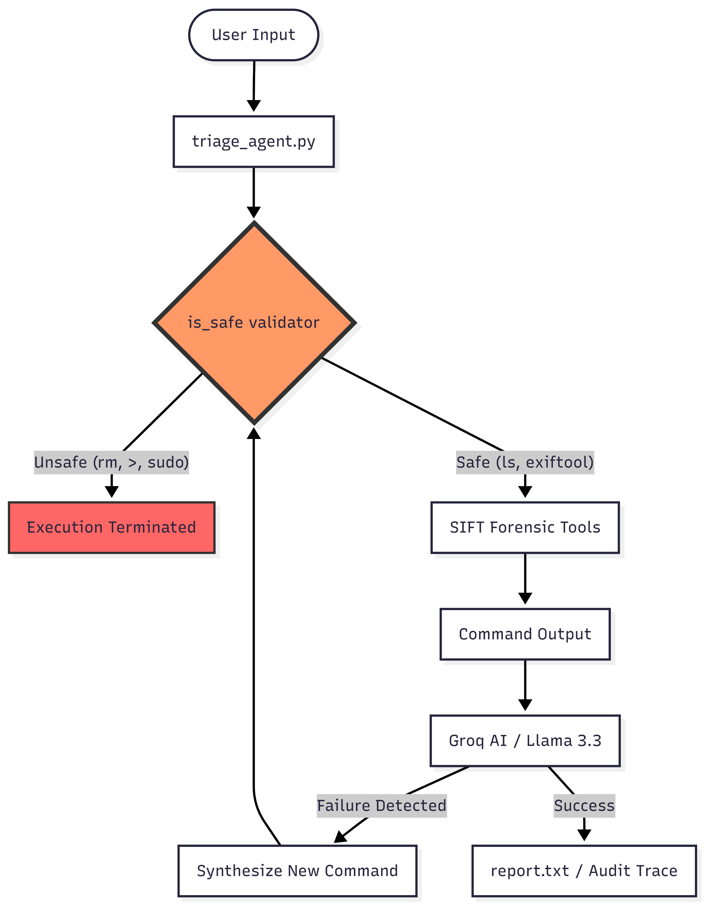

# sift-loop
An autonomous, self-correcting forensic triage agent for the SIFT workstation. Implements a persistent learning loop with architectural read-only enforcement to ensure evidence integrity.

